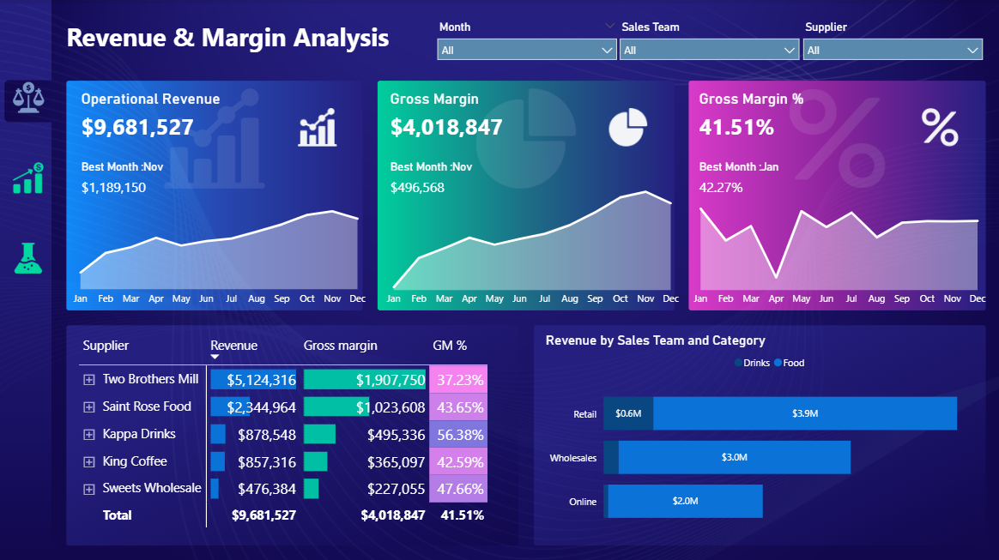

# 💵 Revenue & Margin Analysis — Power BI Dashboard

## 📌 Overview
An interactive Power BI financial dashboard analyzing 
operational revenue, gross margin, and supplier performance 
across multiple sales channels and teams — enabling 
data-driven pricing and capital allocation decisions.

---

## 🛠️ Tools Used
- Power BI Desktop
- DAX (revenue, margin, and percentage calculations)
- Conditional Formatting
- Data Modeling across multiple tables
- Interactive Slicers and Filters

---

## 📊 Dashboard Features

### 🔍 Interactive Filters
- Filter by Month, Sales Team, and Supplier

### 📈 Visualizations
- **Revenue Trend Cards** — Operational Revenue · Gross Margin · GM%
  with monthly sparklines and best month highlights
- **Supplier Breakdown Table** — Revenue, Gross Margin, GM%
  with conditional color formatting
- **Revenue by Sales Team & Category** — 
  horizontal bar chart (Drinks vs Food)
  across Retail, Wholesale, and Online channels

### 🏅 Key Metrics Tracked
| Metric | Value |
|--------|-------|
| Total Operational Revenue | $9,681,527 |
| Total Gross Margin | $4,018,847 |
| Overall Gross Margin % | 41.51% |
| Best Revenue Month | November ($1,189,150) |
| Best Margin Month | January (42.27%) |

---

## 💡 Key Insights Delivered
- Two Brothers Mill generated 53% of total revenue 
  but at the lowest margin (37.23%) — 
  flagging a pricing optimization opportunity
- Kappa Drinks achieved the highest GM% at 56.38% — 
  identifying it as the most profitable supplier
- Online channel contributed $2M revenue with 
  significant growth potential vs Retail ($4.5M)
- November was peak revenue month — 
  supporting seasonal inventory and staffing planning

---

## 📷 Dashboard Preview

---

## 👤 Author
**Ahmed Mohamed Sedek** — Data Analyst
📧 ahmedsedek295@gmail.com
🔗 [LinkedIn](https://www.linkedin.com/in/ahmed-sedek-2869a1244)
🌍 Cairo, Egypt · Open to remote opportunities
